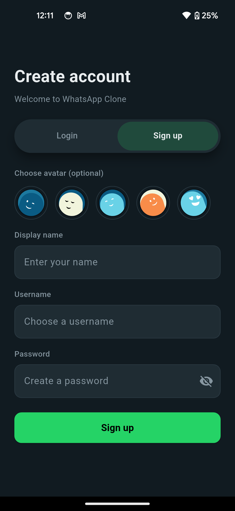
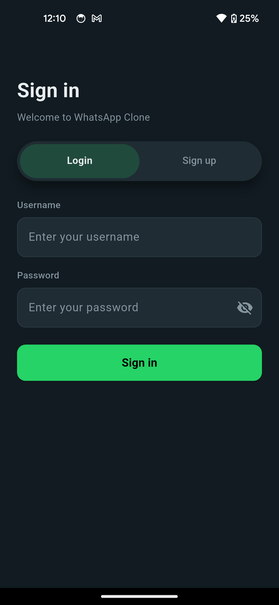
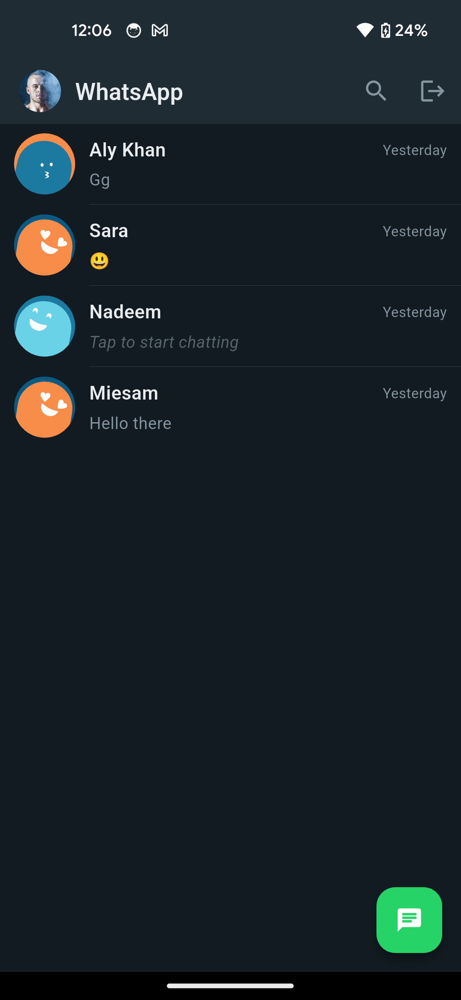
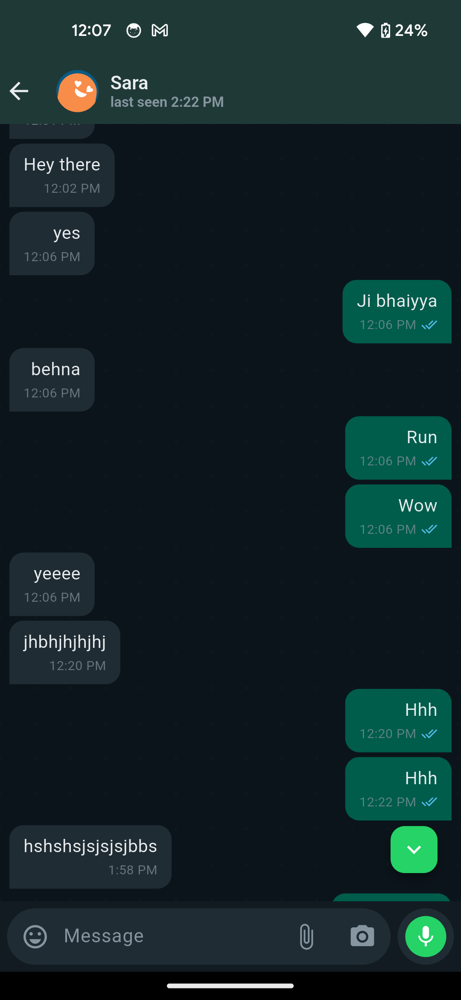
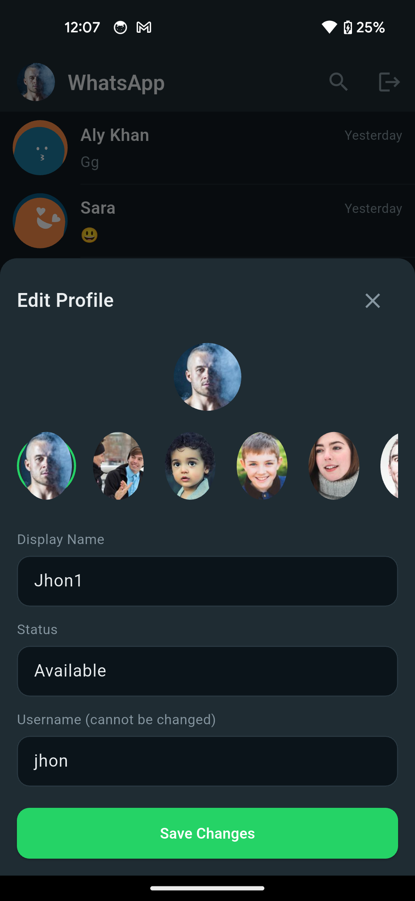
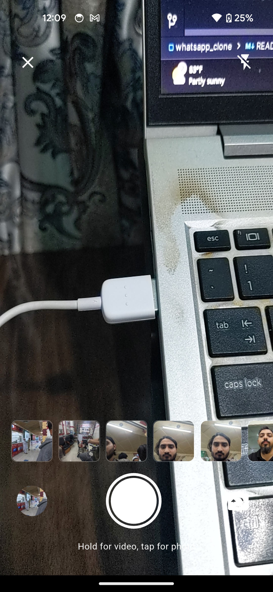
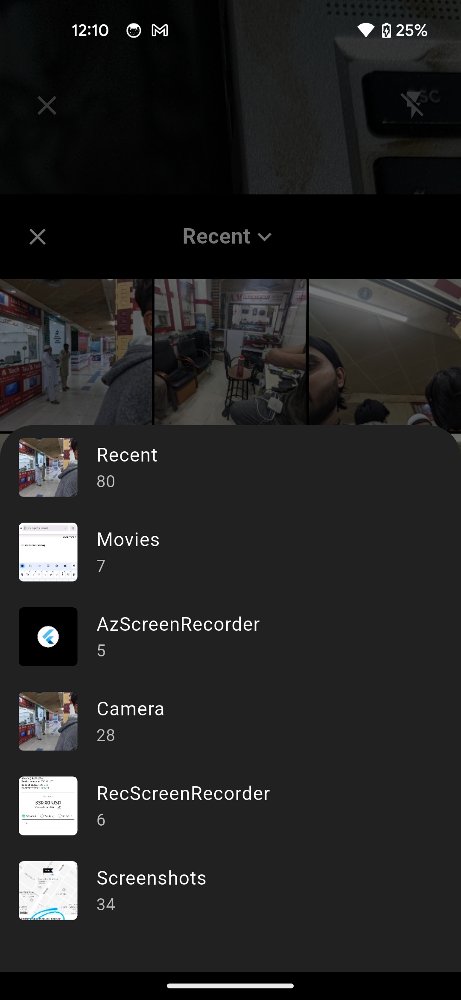
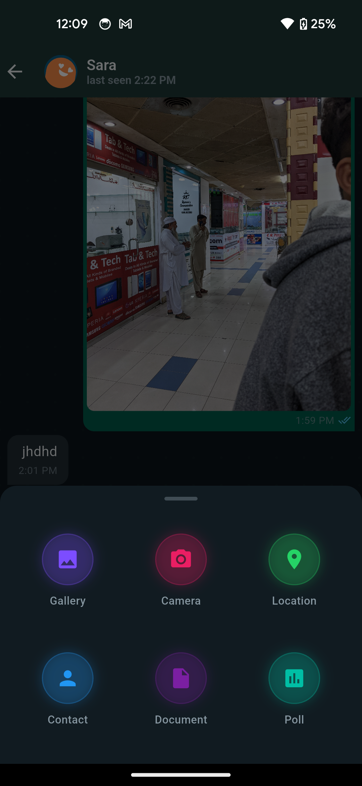
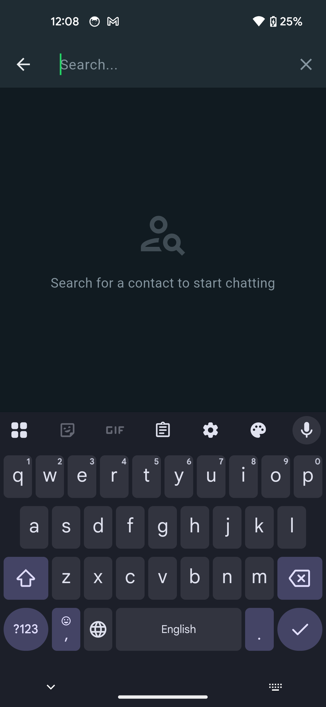
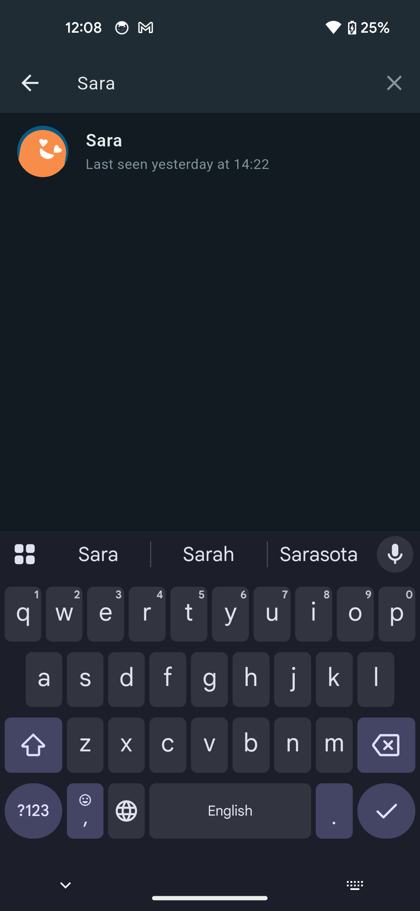

# WhatsApp Clone (Flutter)

A scalable, real-time chat application built with **Flutter**, designed to replicate core WhatsApp features including messaging, media sharing, typing indicators, and live presence.

---

## 🚀 Overview

This project is a **production-ready chat client** that integrates with a WebSocket-powered backend for real-time communication and REST APIs for data persistence.

It follows a clean architecture approach using **BLoC/Cubit**, ensuring maintainability, scalability, and testability.

---

## ✨ Features

### 💬 Messaging

* Real-time one-to-one chat using WebSockets
* Optimistic UI updates for instant feedback
* Message status indicators:

    * ✓ Sent
    * ✓✓ Delivered
    * ✓✓ Read (blue)

### 📩 Conversation Management

* Conversation list with last message preview
* Unread message counters
* Auto-sorting by latest activity

### ⌨️ Typing & Presence

* Typing indicators ("Typing...")
* Online / Offline status
* Last seen timestamps

### 📎 Media & Attachments

* Image sharing
* Video sharing
* Audio (voice notes)
* Document uploads

### ✏️ Message Actions

* Edit messages
* Delete messages
* Reply to messages
* Forward messages
* Emoji reactions

### 🔒 User Controls

* Block / Unblock users
* Mute conversations

### 👤 Profile Management

* Update display name
* Upload profile picture
* Update status text

### ⚡ Performance Optimizations

* Pagination (limit-based message loading)
* Lazy loading of chat history
* Efficient socket event handling

---

## 🏗️ Architecture

The app follows **Clean Architecture + BLoC pattern**:

```
Presentation Layer (UI)
    ↓
BLoC / Cubit (State Management)
    ↓
Domain Layer (UseCases)
    ↓
Data Layer (Repositories)
    ↓
Remote Data Source (REST + WebSocket)
```

---

## 🛠️ Tech Stack

* **Flutter (Dart)**
* **BLoC / Cubit** – State management
* **Dio** – REST API handling
* **WebSocket** – Real-time communication
* **Secure Storage** – JWT persistence

---

## 🔐 Authentication Flow

1. User logs in via API
2. JWT token is stored securely
3. Token is used for:

    * REST API calls
    * WebSocket connection

---

## 🔄 Real-Time Flow

1. Connect to WebSocket with JWT
2. Send/Receive events:

    * `send_message`
    * `new_message`
    * `message_status_update`
    * `typing_indicator`
3. Update UI instantly using BLoC state updates

---

## 📱 Screens

### 🧾 Chat List Screen

* Displays all conversations
* Shows unread message counts
* Supports search functionality

### 💬 Chat Detail Screen

* Real-time messaging UI
* Typing indicator
* Media preview
* Message actions (reply/edit/delete)

### 👤 Profile Screen

* Update user details
* Upload avatar

---

## 📸 Screenshots

> Below are the app screenshots.

### Sign Up



### Login



### Chat List



### Chat Screen



### Profile Screen



### Camera Screen



### Gallery Screen



### Attachments Screen



### Contact Screen Empty



### Contact Screen



---

## 📂 Project Structure

```
lib/
 ├── core/
 │   ├── network/
 │   ├── constants/
 │   └── utils/
 │
 ├── data/
 │   ├── models/
 │   ├── repositories/
 │   └── datasources/
 │
 ├── domain/
 │   ├── entities/
 │   ├── usecases/
 │   └── repositories/
 │
 ├── presentation/
 │   ├── screens/
 │   ├── widgets/
 │   └── bloc/
 │
 └── main.dart
```

---

## 📌 Key Implementation Highlights

* Socket-driven architecture for real-time updates
* Separation of concerns using clean architecture
* Efficient pagination for large chat histories
* Robust error handling and retry mechanisms

---

## 🧪 Future Improvements

* Group chat support
* Push notifications (FCM)
* End-to-end encryption
* Message search inside chat
* Voice/video calling

---

## 🤝 Contribution

Contributions are welcome. Feel free to fork the repository and submit pull requests.

---

## 📄 License

This project is licensed under the MIT License.

---

## 👨‍💻 Author

**Shafiq Ur Rehman**

---

## ⭐ Support

If you find this project useful, consider giving it a star ⭐ on GitHub.
